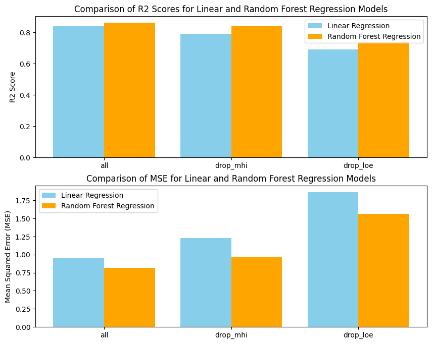

# Analysis of EV Adoption in California

Welcome to the Electric Vehicle Adoption Analysis project! This project aims to analyze and understand the trends in Electric Vehicle Adoption rates in California.

## Getting Started

Follow these instructions to get a copy of the project up and running on your local machine.

### Prerequisites

Make sure you have the following installed on your machine:

- Python (version 3.9>=)

### Installation

1. Clone the repository to your local machine:

   ```bash
   git clone https://github.com/yasho191/ECE143_EV_Adoption_Analysis
   ```

2. Navigate to the project directory:

   ```bash
   cd ECE143_EV_Adoption_Analysis
   ```

3. Install the required dependencies:

   ```bash
   pip install -r requirements.txt
   ```

### Running the Analysis

1. Open the `final_analysis.ipynb` notebook.

2. Run the notebook cells to execute the analysis steps.

## Introducton

Welcome to the "Electric Vehicle Adoption Analysis" project! In this comprehensive study, we delve into various facets of electric vehicle (EV) adoption in California, aiming to gain valuable insights into current trends and patterns. The project is structured around five key questions, each exploring different aspects of EV adoption.

## Project Overview

### Q1: Electric Vehicle Adoption Patterns

We kick off our analysis by investigating the distribution of electric vehicles across different ZIP codes in California. By mapping and visualizing this distribution, we aim to identify regions with varying levels of EV adoption.


### Q2: Demographic Correlations

Moving beyond spatial analysis, we explore potential correlations between demographic characteristics and electric vehicle adoption. Specifically, we examine the influence of ethnicity and education level on the adoption of EVs, unraveling interesting insights into the societal dynamics of EV ownership.


### Q3: Economic Factors

Understanding the impact of economic factors on electric vehicle adoption is crucial. Our analysis involves a geographic study, correlation examination, and scatter plotting to uncover the intricate relationships between economic indicators and the prevalence of EVs.


### Q4: Fuel Types and Preferences

We delve into the preferences for different types of alternative fuel vehicles, presenting our findings through visually engaging pie charts and bar charts accompanied by scatter plots. This section provides a comprehensive view of the landscape of alternative fuel choices.

### Q5: Predictive Modeling

In the final leg of our project, we embark on predictive modeling. Leveraging the power of linear regression and random forest regression, we attempt to forecast electric vehicle adoption based on a combination of demographic and economic factors. This predictive analysis adds a forward-looking dimension to our exploration.

We consider 2 Machine learning models: 1. Linear Regression 2. Random Forest Regressor. We use only the demographic and economic features for the prediction. As we earlier explored that household income and level of education are highly correlated with each other we also try to study the inmpact of using both these features or either one of these features for predictions. The experimental results are as follows



| Model                   | Features                   | R2 Score | Mean Squared Error (MSE) |
|-------------------------|----------------------------|----------|---------------------------|
| Linear Regression       | All features               | 0.84     | 0.96                      |
| Linear Regression       | Drop Median Household Income | 0.79   | 1.23                      |
| Linear Regression       | Drop Level of Education     | 0.69     | 1.86                      |
| Random Forest Regression | All features               | 0.86     | 0.82                      |
| Random Forest Regression | Drop Median Household Income | 0.84   | 0.97                      |
| Random Forest Regression | Drop Level of Education     | 0.74     | 1.56                      |

**Insights:**

1. **Model Performance:** Both Linear Regression and Random Forest Regression show promising performance, with R2 scores ranging from 0.69 to 0.86. These scores indicate a reasonably good fit of the models to the data.

2. **Feature Importance:** The models consistently perform well when using all features. However, dropping either the "Median Household Income" or "Level of Education" leads to a decrease in model performance. This suggests that both these features contribute significantly to predicting electric vehicle adoption.

3. **Correlation Impact:** The observed high correlation between household income and education level does not lead to multicollinearity issues affecting model performance. Including both features seems beneficial, emphasizing their independent impact on predicting EV adoption.

4. **Random Forest Advantage:** Random Forest Regression consistently outperforms Linear Regression across all scenarios. The ensemble nature of Random Forest allows it to capture complex relationships in the data, contributing to its superior predictive ability.

5. **Feature Drop Impact:** The drop in R2 scores and the increase in MSE when removing features indicate the importance of considering multiple demographic and economic factors for accurate predictions. A holistic approach considering various aspects yields better results than relying on a single feature.

## Project Methodology

Throughout the project, we employ a blend of geospatial analysis, correlation studies, scatter plots, and predictive modeling to comprehensively address each question. The diversity in our analytical approaches ensures a holistic understanding of the factors influencing electric vehicle adoption.

Join us on this journey as we unravel the intricacies of electric vehicle adoption in California, combining data-driven insights with a keen focus on geographic, demographic, and economic dynamics. Let's uncover the trends shaping the future of sustainable transportation.

## License

This project is licensed under the [MIT License](LICENSE) - see the [LICENSE](LICENSE) file for details.

## Acknowledgments

- Mention any resources, tools, or datasets you used.
- Give credit to contributors or authors of external code.

Thank you for exploring the Electric Vehicle Adoption Analysis project! If you have any questions or feedback, feel free to contact us. Happy analyzing!
