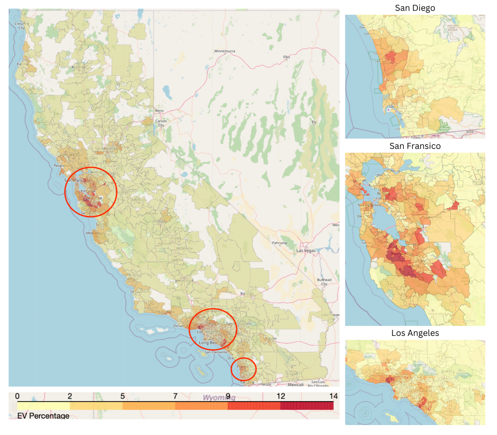
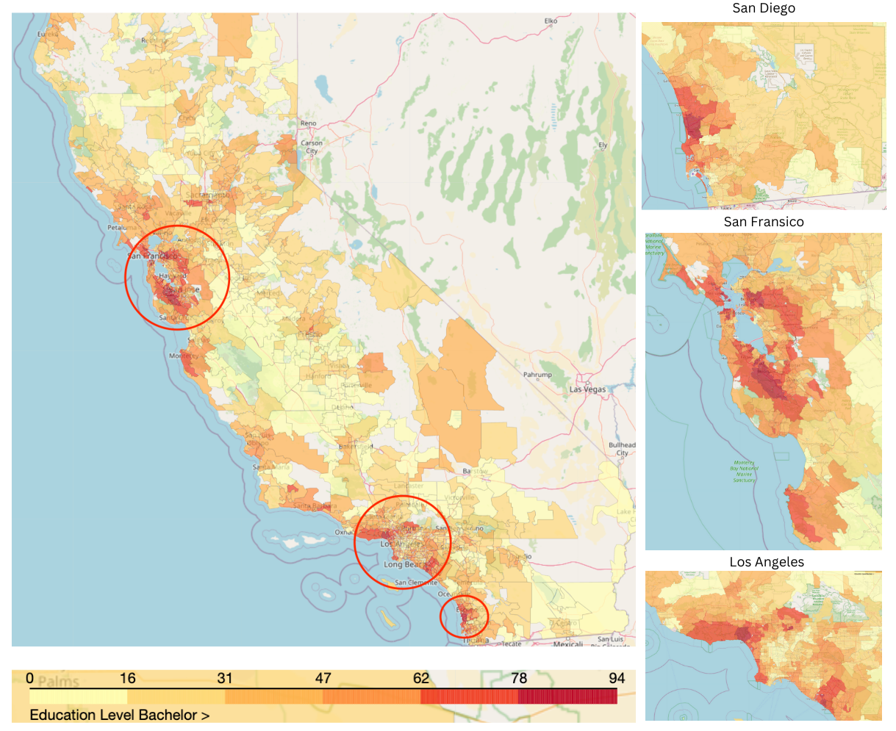
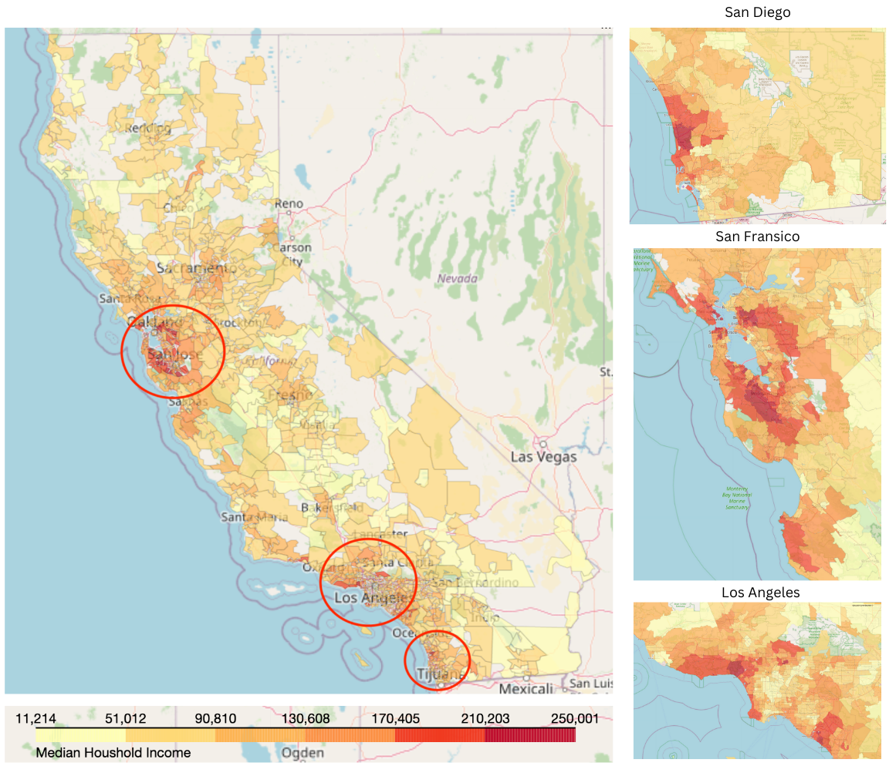

# Analysis of EV Adoption in California

## Introducton

Welcome to the "Electric Vehicle Adoption Analysis" project! In this comprehensive study, we delve into various facets of electric vehicle (EV) adoption in California, aiming to gain valuable insights into current trends and patterns. The project is structured around five key questions, each exploring different aspects of EV adoption.

## Project Overview

### Q1: Electric Vehicle Adoption Patterns

We kick off our analysis by investigating the distribution of electric vehicles across different ZIP codes in California. By mapping and visualizing this distribution, we aim to identify regions with varying levels of EV adoption.

### Q2: Demographic Correlations

Moving beyond spatial analysis, we explore potential correlations between demographic characteristics and electric vehicle adoption. Specifically, we examine the influence of ethnicity and education level on the adoption of EVs, unraveling interesting insights into the societal dynamics of EV ownership.

### Q3: Economic Factors

Understanding the impact of economic factors on electric vehicle adoption is crucial. Our analysis involves a geographic study, correlation examination, and scatter plotting to uncover the intricate relationships between economic indicators and the prevalence of EVs.

### Q4: Fuel Types and Preferences

We delve into the preferences for different types of alternative fuel vehicles, presenting our findings through visually engaging pie charts and bar charts accompanied by scatter plots. This section provides a comprehensive view of the landscape of alternative fuel choices.

### Q5: Predictive Modeling

In the final leg of our project, we embark on predictive modeling. Leveraging the power of linear regression and random forest regression, we attempt to forecast electric vehicle adoption based on a combination of demographic and economic factors. This predictive analysis adds a forward-looking dimension to our exploration.

## Project Methodology

Throughout the project, we employ a blend of geospatial analysis, correlation studies, scatter plots, and predictive modeling to comprehensively address each question. The diversity in our analytical approaches ensures a holistic understanding of the factors influencing electric vehicle adoption.

Join us on this journey as we unravel the intricacies of electric vehicle adoption in California, combining data-driven insights with a keen focus on geographic, demographic, and economic dynamics. Let's uncover the trends shaping the future of sustainable transportation.
